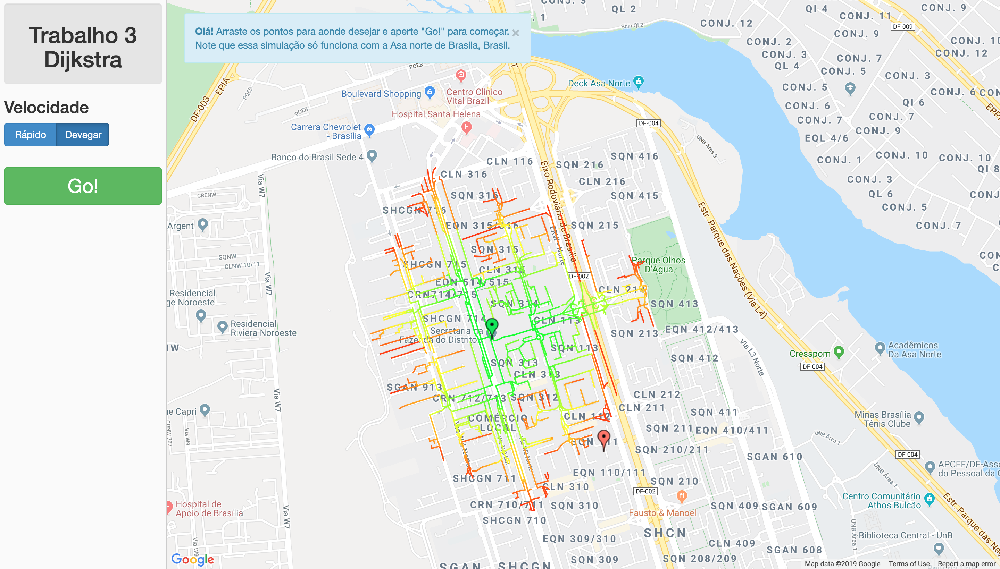

# Dijkstra no Google Maps

Neste projeto foi implementado o algoritmo ambicioso dijkstra no google maps, com a posibilidade de poder escolher os lugares de inicio e fim da busca.

## Install & Run

    pip install -r requirements.txt
    python3 main.py

Se ocorrer um erro ao carregar o mapa, crie sua conta na API do Google Maps, crie a Key
e coloque sua chave no arquivo static/gmaps.js

## Screenshot



## Gerar Grafos de outros lugares

Nesta simulação, foi mapeado apenas Brasília (Bairro Asa Norte).
Para poder visualizar o algorítmo em outros lugares, é necessrário:

1. Exportar a região desejada do [OpenStreetMap](https://www.openstreetmap.org/)

2. fazer o parse do arquivo com:

```
python routing/OsmGraph.py # python2
```

alterando a rota do .osm no final do arquivo

3. no arquivo main.py mudar:

```
with open("routing/graph_data/brasilia.j") as fp:
    graph = json.loads(fp.read())
with open("routing/graph_data/brasilia_coords.j") as fp:
    graph_coords = json.loads(fp.read())
```

para

```
with open("sua_rota/seu_arquivo.j") as fp:
    graph = json.loads(fp.read())
with open("sua_rota/seu_arquivo_coords.j") as fp:
    graph_coords = json.loads(fp.read())
```
